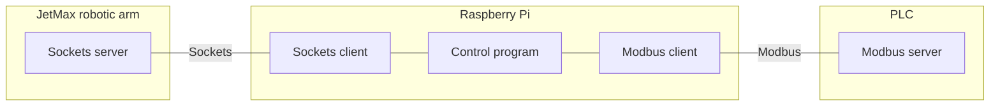
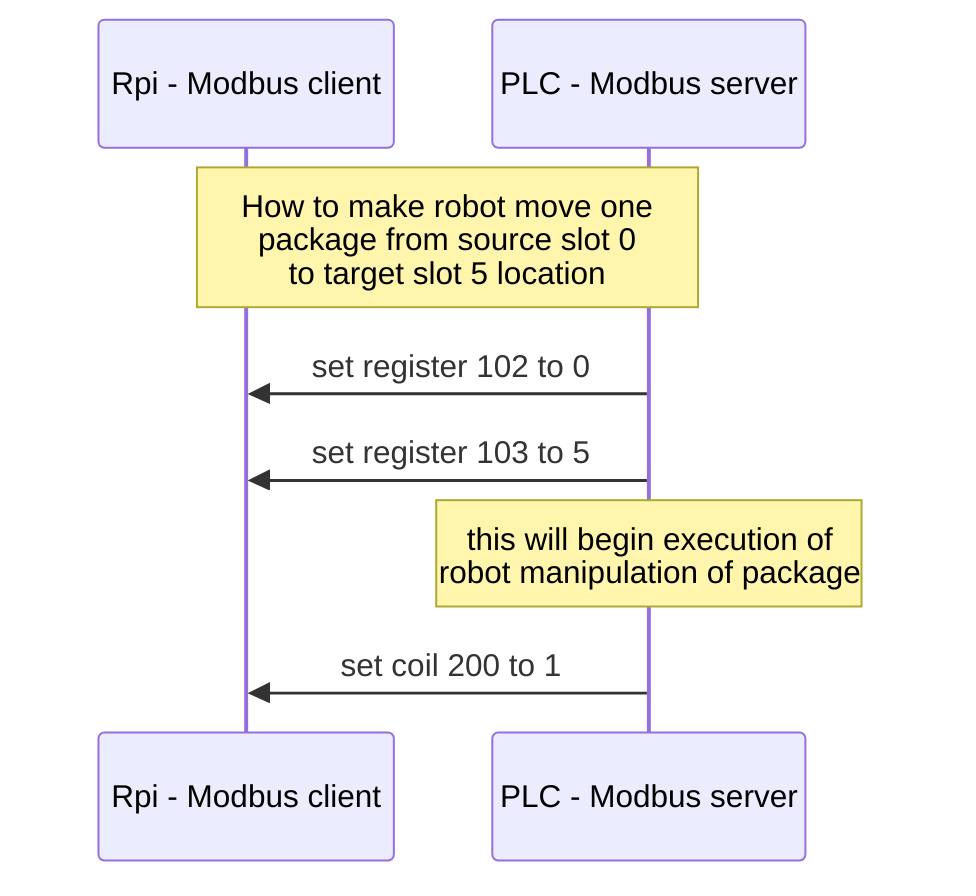

# Rack warehouse model for PLC

Rack warehouse implementation with JetMAx HiWonder robotic arm in NodeJs runtime environment. The diagram shows connection betwen robotic arm and PLK.

## Physical layer

### Robot
Rack warehouse has 4 docs with capacity to stack 4 packages on top of each other as is shown in figure

|||||
|---|---|---|---|
|slot 12|slot 13|slot 14|slot 15|
|slot 8|slot 9|slot 10|slot 11|
|slot 4|slot 5|slot 6|slot 7|
|slot 0|slot 1|slot 2|slot 3|

Each slot is numbered as shown in table above and each slot has exact coordiantes regarding robot coordinate system (coordinates are defined in [config file](https://github.com/fsprojekti/rack-warehouse-jetmax/blob/master/config.js))

## Application layer

### JetMax socket server
This server is preinstalled on the JetMax robotic arm computer. With sockets clinet it is possible to control robot.

### Raspberry Pi
Rasspery Pi serves as a middleware hardware that connects robot with the PLC. With robot it connects via sockets protocol and with PLK it connects via ModBus TCP/IP protocol. 

Modbus variables
|Register|Type|Read/Write|Name|Description|Instructions|
|---|---|---|---|---|---|
|100|register|Read|slots|Current state slot occupation (masked 16bit integer)|slots variable is masked 16bit integer. Each bit represents one slot in a warehouse totaling to 16 slots
|200|coil|Write|execute|Begin moving robot according to selected coordinates|triggers on rising edge (0->1)
|201|coil|Read|suck|State of sucking gripper|false - not sucking, true - sucking
|101|register|Read|state|State of the warehouse|0-idle, 1-moving, 2-error)
|102|register|Write|slot_source|Source slot number from which package will be taken|values from 0 to 15
|103|register|Write|slot_target|Target slot number to which package will be put|values from 0 to 15

Example of manipulation robot to move package from slot 0 to slot 5

### PLC
PLC host modbus server end of communication. The manipulation of the warehouse is done primary from the PLC side. The protocol is described in diagram

