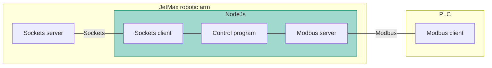
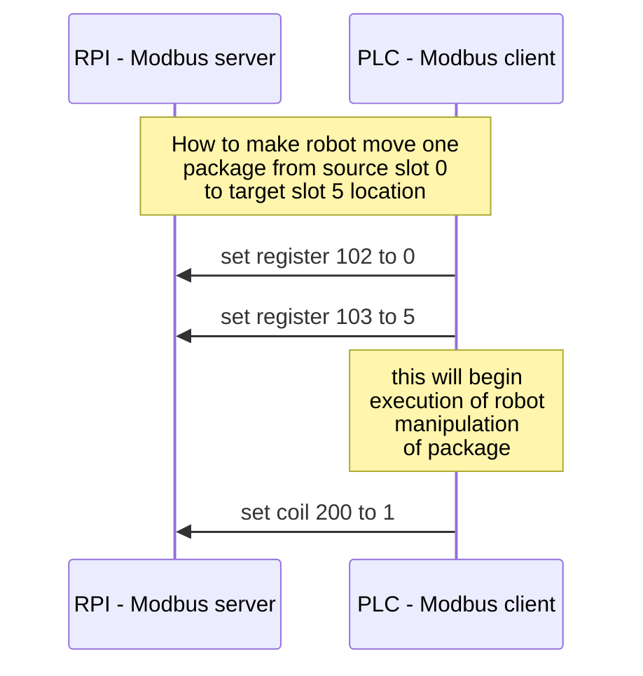

# Rack warehouse model for PLC

Rack warehouse implementation with JetMax HiWonder robotic arm in Node.js runtime environment.

## Devices

There are two hardware devices: JetMax robot and Raspberry Pi.

### Robot
Rack warehouse has 4 docks with capacity to stack 4 packages on top of each other as shown in figure below.

|||||
|---|---|---|---|
|slot 12|slot 13|slot 14|slot 15|
|slot 8|slot 9|slot 10|slot 11|
|slot 4|slot 5|slot 6|slot 7|
|slot 0|slot 1|slot 2|slot 3|

Each slot is enumerated as shown in table above and each slot has exact coordinates with reference to the robot coordinate system (coordinates are defined in [config file](https://github.com/fsprojekti/rack-warehouse-jetmax/blob/master/config.js))

Rack warehouse has two additional slots, one for loading a package into the warehouse and another for unloading packages from warehouse.
Layout of slots is shown in figure below.

### Raspberry Pi
This is device on which applications for communication with robot on one side and with PLC on the other side are running. 

## Applications

Applications run on devices. JetMax robotic arm runs Socket server and Raspberry Pi runs Socket client, Control program and Modbus server application.

### Socket server
Socket server is pre-installed on the JetMax robotic arm computer. With Socket client it is possible to control the robot.

### NodeJs
NodeJs application runs on JetMax robotic arm computer and enables three modules Socket client, Control program and Modbus server.

#### Socket client
Enables communication with JetMax robotic arm socket server. 

#### Control program
Control program function is:
* store state of the warehouse
* translate messages between Modbus server and Socket client
* move robot to properly manipulate packages

#### Modbus server
Modbus server application that enables communication with other devices via Modbus protocol. API of this communication is specified in communication section.

### PLC
PLC device is just an example of device that can communicate with the Rack warehouse device via Modbus protocol.

## Communication APIs

### Socket
Specification of this protocol can be found at: https://github.com/JetMaxRoboticArm

### Modbus

Modbus communicates via registers

|Register|Type|Read/Write|Name|Description|Instructions|
|---|---|---|---|---|---|
|100|register|Read|slots|Current state slot occupation (masked 16bit integer)|slots variable is masked 16bit integer. Each bit represents one slot in a warehouse totaling to 16 slots
|200|coil|Write|execute|Begin moving robot according to selected coordinates|triggers on rising edge (0->1)
|101|register|Read|state|State of the warehouse|0-idle, 1-moving, 2-error)
|102|register|Write|slot_source|Source slot number from which package will be taken|values 0-load slot, 1-unload slot, 2,3...17 warehouse slots
|103|register|Write|slot_target|Target slot number to which package will be put|values 0-load slot, 1-unload slot, 2,3...17 warehouse slots
|300|coil|Read|state slot load|state of slot|always false
|301|coil|Read|state slot unload|state of slot|always false
|302|coil|Read|state slot|state of warehouse slot 0|
|303|coil|Read|state slot|state of warehouse slot 1|
|304|coil|Read|state slot|state of warehouse slot 2|
|305|coil|Read|state slot|state of warehouse slot 3|
|306|coil|Read|state slot|state of warehouse slot 4|
|307|coil|Read|state slot|state of warehouse slot 5|
|308|coil|Read|state slot|state of warehouse slot 6|
|309|coil|Read|state slot|state of warehouse slot 7|
|310|coil|Read|state slot|state of warehouse slot 8|
|311|coil|Read|state slot|state of warehouse slot 9|
|312|coil|Read|state slot|state of warehouse slot 10|
|313|coil|Read|state slot|state of warehouse slot 11|
|314|coil|Read|state slot|state of warehouse slot 12|
|315|coil|Read|state slot|state of warehouse slot 13|
|316|coil|Read|state slot|state of warehouse slot 14|
|317|coil|Read|state slot|state of warehouse slot 15|

Example of manipulation of robot to move package from load slot 0 to storage slot 5

