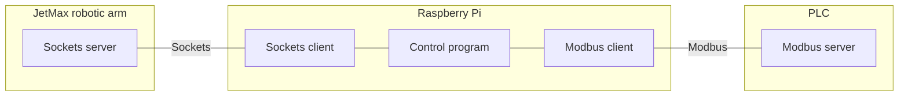

# Rack warehouse model for PLC

Rack warehouse implementation with JetMAx HiWonder robotic arm. The diagram shows connection betwen robotic arm and PLK.

## JetMax socket server
This server is preinstalled on the JetMax robotic arm computer. With sockets clinet it is possible to control robot.

## Raspberry Pi
Rasspery Pi serves as a middleware hardware that connects robot with the PLC. With robot it connects via sockets protocol and with PLK it connects via ModBus TCP/IP protocol. 

## PLC
PLC host modbus server end of communication. The manipulation of the warehouse is done primary from the PLC side. The protocol is described in diagram

